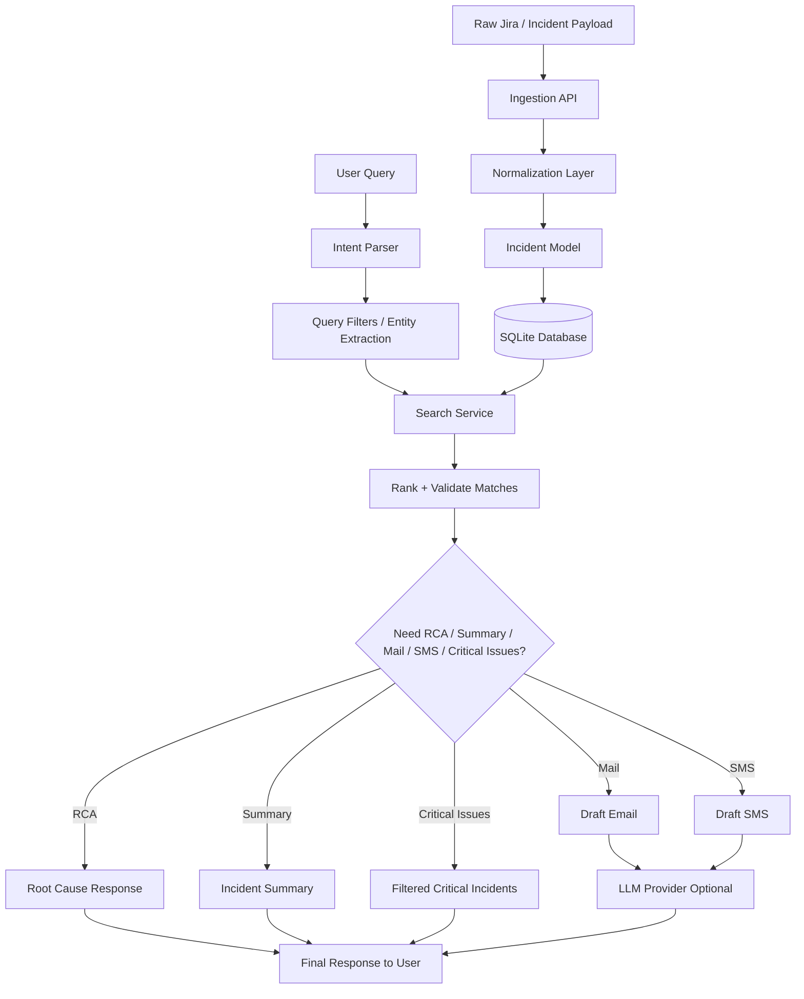
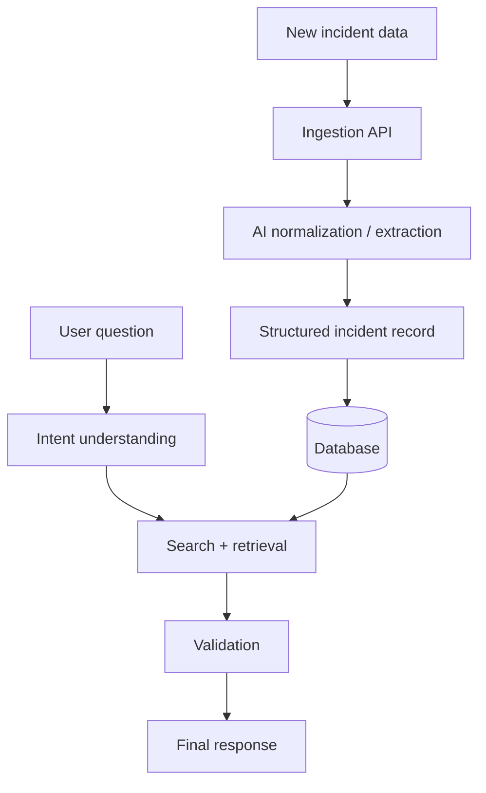

# IncidentIQ Demo Project Explanation

## 1. The real business problem we are solving

We are not just building a search tool for incidents. We are building an intelligence layer on top of resolved production issues.

Most organizations already have large volumes of production incidents in Jira, service tools, and ticketing systems. These tickets contain valuable knowledge:

- what failed
- which service or third-party dependency was involved
- what the real root cause was
- how it was resolved
- what code fix or workaround was applied
- who owned the incident and who fixed it
- whether it was a recurring problem

The challenge is that this knowledge is scattered and hard to reuse.

So the main idea behind IncidentIQ is:

- collect and structure resolved production issues
- make them searchable and queryable
- turn historical incident knowledge into a reusable operational intelligence system
- help teams prevent repeated mistakes and debug faster

This becomes a platform for multiple stakeholders:

- Product owners track recurring failures and customer impact
- Engineering managers see which teams or third parties are creating the most incidents
- Support teams quickly find the RCA of past similar incidents
- Developers debug new issues by searching prior resolved incidents that match the same error pattern
- Leadership can monitor recurring outage trends and third-party risk

---

## 2. Why this is valuable beyond a normal ticket system

A ticketing system records incidents, but it does not truly understand them.

A normal Jira ticket gives us the incident description, but not the deeper business intelligence:

- Which defects occur most frequently?
- Which third-party vendors are causing the most issues?
- Which services are repeatedly failing due to the same root cause?
- Which issues were resolved before and how?
- Which recurring bug can be linked to a past fix?

IncidentIQ adds the missing intelligence layer.

It answers questions like:

- Which third-party integrations are failing the most?
- Which incidents are recurring across different teams?
- Which service has the highest number of production problems?
- What was the root cause and resolution for a specific error pattern?
- Can we reuse an earlier fix for a newly reported issue?

This turns historical incident data into an operational knowledge base.

---

## 3. Demo framing: this is a production incident intelligence platform

For the demo, we should position the project as a platform that helps engineering and operations teams work smarter with historical incident knowledge.

### Core use cases

#### A. Dashboard for stakeholders

The system can be used to build a dashboard that shows:

- total incidents by severity
- recurring issue categories
- most frequent third-party dependencies involved
- top failing services or modules
- issue trends over time
- number of incidents resolved versus open
- teams with repeated instability patterns

This is useful for:

- product owners
- engineering leadership
- support managers
- platform teams
- SRE and operations stakeholders

#### B. Faster debugging for developers

When a new issue happens, a developer may search by:

- error message
- service name
- dependency name
- exception type
- issue summary keywords

The system can then return:

- past incidents with similar patterns
- the root cause
- the resolution summary
- code fix details or workaround
- validation steps used earlier

This prevents re-solving the same problem multiple times.

#### C. Knowledge reuse across flows

We are not just storing tickets; we are storing institutional knowledge.

If a team previously fixed a database timeout, payment gateway outage, Redis issue, or vendor API dependency problem, that knowledge can now be reused when similar issues appear again.

This is a major time saver for engineering teams.

#### D. PR reviewer and code intelligence extension

This can be extended beyond incident support.

Imagine a developer opens a PR and the system checks:

- does this change touch a previously failing service?
- are there previous incidents tied to similar code areas?
- was there a past RCA for this pattern?
- did a similar bug already get fixed before?

This makes it useful as a PR reviewer plugin, where the tool can highlight:

- known risky areas
- historical issue patterns
- prior root-cause references
- relevant incident learnings tied to the code being changed

This is a powerful future direction because it connects engineering decision-making to real production experience.

---

## 4. What kind of data we store and why

The project stores structured information from production issues, not just raw ticket text.

### Example data fields

- issue key
- summary
- description
- severity
- service / team
- assignee
- reporter
- labels / tags
- third-party integration involved
- comments and notes
- root cause
- resolution
- code fix details or workaround
- raw payload for traceability

This is important because a resolved production issue is valuable if it contains the following:

- what actually failed
- why it failed
- how it was fixed
- what to monitor next time

That is the real reusable knowledge we want to keep.

---

## 5. Why this is important for product and leadership

This platform helps show patterns beyond one-off incidents.

Examples:

- third-party vendor X causes 40% of service degradation incidents
- payment gateway issues are recurring during peak traffic
- Redis connection pool issues occur after deployment changes
- SSO timeouts are concentrated in certain regions or environments

This gives leaders real operational insight instead of scattered ticket noise.

It helps move from reactive incident handling to proactive issue prevention.

---

## 6. Why this is agentic

This is agentic because the system does not simply return matching text from a database.

It behaves like an operational reasoning assistant.

### How it thinks

When a user asks a question, the system:

1. understands the user intent
2. extracts relevant entities and filters
3. identifies what kind of answer is needed
   - RCA only
   - critical issue list
   - summary of repeated incidents
   - email draft to manager
   - search for similar prior bugs
4. searches the database for grounded evidence
5. validates whether the result actually matches the request
6. decides what final response format to produce
7. may summarize, draft a message, or ask a clarifying question if needed

This is agentic behavior because it plans, decides, filters, validates, and acts.

### Example of agentic reasoning

If the user asks:

"Give me only the RCA of issues fixed by Kuldeep and draft a mail to my manager"

The system understands:

- this is an RCA request
- assignee is Kuldeep
- the user wants a communication artifact as well
- the answer should be evidence-based
- the final result should not be generic output; it should use actual incident facts

This is a real reasoning workflow, not just a keyword match.

---

## 7. Why this is better than generic AI search

A generic LLM may give a plausible answer, but it may not be grounded in historical ticket evidence.

This platform is different because:

- it searches the actual stored incident records first
- it uses the database as the source of truth
- it ranks results based on relevance and evidence
- it reduces hallucination risk
- the final answer can be grounded in past incident facts

This makes it dependable for real engineering workflows.

---

## 8. Demo story to tell live

Here is a strong business-facing demo narrative:

"We are building an operational intelligence system for production incidents. The idea is simple: every resolved issue is an asset. If we store the incident data properly, we can not only search it later but also understand trends, recurring failures, third-party dependencies, and past fixes. That means a developer facing a new bug can search for a similar error and immediately find the earlier RCA, resolution, and fix pattern. It also gives managers and product owners a dashboard to track recurring pain points and third-party issues across systems. This is not just search; it is a reusable knowledge base for engineering operations."

---

## 9. Example scenarios for the demo

### Scenario 1: New issue debugging

A developer sees a MySQL timeout issue in production.

He searches:

"database connection pool timeout and vendor x issue"

The system returns:

- earlier incident with same pattern
- root cause summary
- resolution notes
- probable fix area
- previous workaround or code patch

This saves hours of investigation.

### Scenario 2: Product owner dashboard

The product owner asks:

"What are the most frequent issues and third-party incidents this month?"

The system can show:

- top failure categories
- third-party issues by frequency
- service-level impact summary
- recurring problems that need engineering attention

### Scenario 3: Manager update

"Give me critical issues and draft a mail to my manager"

The system reads the query, filters incidents by severity, and drafts a brief communication using actual ticket facts.

### Scenario 4: RCA reuse

"Give me only the root cause for issues fixed by Kuldeep"

The system quickly retrieves grounded RCA details from historical incidents without generic answers.

---

## 10. Future scopes and expansion

This project has a strong future roadmap beyond the current demo.

### A. Executive dashboard

Add dashboards for:

- incident trends
- recurring failures
- vendor impact analysis
- issue frequency by service
- mean time to resolve
- most affected teams

### B. Alert-to-incident correlation

Connect pipeline signals and alerts to incident records so the system can correlate:

- alert spikes
- deployment windows
- service dependencies
- failed vendor calls
- related incident patterns

### C. Knowledge graph / incident map

Build a graph of:

- service to service dependencies
- vendor to incident relationships
- code area to past incidents
- engineer to resolved issues

This would allow deeper reasoning and better root-cause mapping.

### D. PR reviewer plugin

Integrate with GitHub or GitLab to show:

- if the PR touches a historically risky area
- past incidents tied to the same module
- recommended checks before merging
- notes from prior RCA and resolution paths

This transforms the project from incident search into engineering intelligence.

### E. Runbook and remediation recommendation

Use past incident history to propose:

- mitigation steps
- rollback guidance
- alerting recommendations
- config checks
- safest remediation path

### F. Retrospective and learning engine

Use the stored incident history to generate:

- recurring issue summaries
- weekly problem reports
- lessons learned from major incidents
- postmortem support content

### G. Customer support and escalation support

Support teams can search resolved incidents by:

- customer-facing symptoms
- product area
- vendor outage
- workaround used before

This reduces resolution time and ensures consistent support response.

---

## 11. One-line project summary

IncidentIQ is an evidence-grounded incident intelligence platform that turns resolved production issues into reusable operational knowledge, helping teams debug faster, track recurring failures, monitor third-party risk, and build future AI-powered engineering workflows.

---

## 12. Final demo closing statement

"This is not just a search engine for incidents. It is a production intelligence system that learns from past failures, helps teams find the root cause faster, surfaces recurring patterns, supports leadership dashboards, and creates a reusable knowledge base for engineering and operations. The long-term vision is to extend it into a broader engineering copilot that connects incident history, code changes, and operational decision-making."

---

## 9. Technology stack used and why

### Python

Why it is used:

- fast to build and iterate for AI and agent workflows
- strong ecosystem for data processing, APIs, and LLM integrations
- easy to integrate with FastAPI, LangGraph, SQLAlchemy, and data tooling
- ideal for a production prototype that can later scale into a real platform

### FastAPI

Why it is used:

- lightweight and high-performance Python web framework
- easy API creation for ingestion and retrieval endpoints
- fast validation with Pydantic models
- clean interface for service integration and demo testing

### LangGraph

Why it is used:

- natural fit for multi-step agent workflows
- helps coordinate retrieval, intent understanding, validation, and follow-up actions
- enables structured reasoning steps instead of a single flat prompt call
- suitable for agentic orchestration across ingestion, search, and response generation

### SQLAlchemy

Why it is used:

- clean ORM layer for Python application models
- helps manage incident data persistence and relational queries
- works well with SQLite in local development and can be extended to Postgres later

### SQLite

Why it is used:

- simple, fast, local-first storage for demo and prototype use
- zero setup cost for a working proof of concept
- enough for historical incident storage and retrieval in development environments
- easy to replace with Postgres or a managed relational database in production

### Pydantic

Why it is used:

- robust input validation for API payloads
- ensures clean structured models for ingestion and retrieval requests
- improves reliability and API contract clarity

### OpenAI / Azure OpenAI / OpenAI-compatible / Gemini-compatible providers

Why they are used:

- optional LLM integration for summarization, drafting, and communication generation
- allows flexibility across provider ecosystems and enterprise environments
- supports degraded mode when keys are absent
- keeps the system realistic for real-world production adoption

### Why not rely only on LLMs?

Because the system needs grounded facts, not just generated text. The real value comes from structured historical incident data stored in the database, while LLMs are used to help communicate and summarize those facts.

---

## 10. System design and how it works

### High-level design

The architecture is built in layers:

1. Ingestion layer
   - receives raw Jira-like payloads or incident records
   - normalizes fields like summary, service, assignee, root cause, and resolution
   - stores structured incident information

2. Storage layer
   - stores incidents in SQLite for local demo and dev use
   - keeps both normalized structured data and raw payload traceability

3. Retrieval and reasoning layer
   - parses the user prompt
   - identifies filters such as severity, assignee, service, and RCA intent
   - searches the database first
   - ranks and validates results before returning final output

4. Agent orchestration layer
   - decides whether the user wants RCA, critical issue list, summary, or communication draft
   - routes logic based on intent and retrieved evidence
   - handles multi-part prompts in one request

5. Communication layer
   - uses LLM provider only when available
   - drafts email or SMS content using actual incident facts
   - stays safe and usable even without external credentials

### Why this design is strong

This design gives us the best of both worlds:

- reliable, explainable, fact-based search from the database
- optional AI assistance for summarization and communication output
- a modular architecture that can evolve into production software later

---

## 11. Data flow diagram



This diagram shows the full lifecycle:

- raw production issue enters the system
- it is normalized and stored
- the user asks a question in natural language
- the system infers intent and filters
- the database is queried for actual evidence
- the final output is assembled and returned

---

## 12. Practical workflow in simple words

A normal user flow looks like this:

1. An incident is ingested from Jira or a similar system.
2. The system stores the essential facts in a structured database.
3. A user asks, "Give me critical issues from vendor X and draft a mail."
4. The system detects the request type and filters.
5. It searches the DB for relevant incidents.
6. It ranks and validates the results.
7. It returns grounded incident details and optionally a mail draft.

This is exactly why the system is useful in real-world operations.

---

## 13. Why this architecture matters for the demo

This architecture is strong for a demo because it demonstrates both:

- technical depth
- real business value

It is not just a chat interface with a model. It is a working incident intelligence workflow with data storage, search, reasoning, and output generation.

This makes the project feel like a real product, not just a prototype experiment.

---

## 14. Future design direction

The next evolution would be:

- move storage to Postgres for larger production datasets
- add vector search for semantic matching
- add dashboards and analytics
- integrate with GitHub/GitLab PR review flows
- create an executive KPI dashboard for recurring incident trends
- connect live alerting and monitoring tools to incident intelligence

This gives the project a scalable path from proof-of-concept to production platform.

## Ingestion flow: how the system processes a new incident

The ingestion flow is the system's ability to take a raw production issue and convert it into structured operational knowledge.

In a real-world setup, a new incident may arrive from Jira, a support tool, a service event payload, email, chat logs, or unstructured operational notes. The system does not simply store the raw record as plain text. Instead, it uses an AI-powered ingestion agent to interpret the payload, understand the context, normalize the data, and convert it into a reusable asset for future reasoning and retrieval.

Professional explanation:

- A new issue enters the system through the API endpoint `/ingest`.
- The payload is validated using a request model so the data is in a consistent format.
- The ingestion agent analyzes the incoming data and handles multiple varieties of raw inputs, including different field names, inconsistent formats, partial issue details, and free-text descriptions.
- Using an LLM model such as OpenAI or an OpenAI-compatible provider, the system extracts structured facts such as summary, service name, severity, affected dependency, root-cause clues, assignee, tags, and resolution notes.
- The AI agent helps standardize diverse inputs into a common schema so they can be stored and searched consistently across historical incidents.
- The system stores the normalized record in the database for traceability, operational history, and future retrieval.
- It may also create or update searchable metadata, embeddings, and indexing fields so the issue can later be retrieved by similarity, keywords, and historical patterns.
- The final result is a structured incident record that can be reused for future queries, analytics, dashboards, and decision-making.

Why this matters:

- Real incident data is noisy, inconsistent, and often arrives in multiple formats.
- AI-based normalization reduces manual effort and prevents valuable operational knowledge from being lost in unstructured text.
- Structured ingestion turns fragmented incident information into operational intelligence.
- Without this step, the system would only have scattered ticket text rather than a reusable knowledge base.

This is important because the value of an incident management system is not just storing tickets. It is creating a reliable knowledge base from past issues that can be understood, searched, and reused by AI agents later.

### Which model helps us achieve this?

The ingestion workflow is powered by the configured LLM provider in the platform, such as OpenAI, Azure OpenAI, or an OpenAI-compatible model endpoint. These models help us:

- parse varied unstructured inputs
- identify incident intent and key fields
- extract operational details from descriptions and logs
- normalize data into a common schema
- create consistent metadata for downstream retrieval and search

This is where AI adds value: it helps the system handle multiple data shapes, formats, and writing styles without requiring hardcoded rules for every possible payload variation.

In other words, the model acts as the reasoning layer that turns messy incident data into clean, structured operational knowledge.

---

## Retrieval flow: how the system answers a user query

The retrieval flow is the system's ability to search the stored incident history and return the most relevant evidence-based results for a user need.

When someone asks a query such as "show me incidents related to database failures in payments" or "find similar RCA for vendor API outage," the system does not guess. It follows a structured retrieval workflow.

Professional explanation:

- The user sends a request to `/retrieve` with a natural language query.
- The intent router interprets the query and decides whether it is a search, root-cause lookup, trend question, or incident-based investigation.
- The retrieval agent searches the database and/or vector store for similar incidents.
- Matching incidents are scored using relevance, keywords, metadata, and semantic similarity.
- The result validator checks whether the results are meaningful and grounded in actual incident data.
- The response formatter produces a clean summary that is easy to understand for the user.

This means the system is not just returning a generic AI answer. It is grounding the answer in real historical incident information stored by the platform.

Why this matters:

- Engineers need evidence, not guesses.
- Support teams need relevant past incidents, not broad summaries.
- Managers need accurate operational insight, not unverified AI-generated content.

The retrieval layer turns the stored knowledge into practical action.

---

## Why ingestion and retrieval together make the system agentic

The true value of the project is the combination of ingestion and retrieval working together as a closed intelligence loop.

This is what makes it agentic:

- Ingestion captures and normalizes new knowledge.
- Retrieval uses that stored knowledge to answer future questions.
- Routing and decision-making decide which agent or workflow should handle a request.
- Validation ensures that outputs are trustworthy and useful.
- The system adapts to different user needs and operational scenarios instead of doing a single fixed action.

In simple terms:

- ingestion builds the memory
- retrieval accesses the memory
- orchestration decides how to act
- validation ensures reliability
- the system behaves like an intelligent assistant, not a static application

This is the core definition of an agentic system: it can take input, reason over context, select actions, access stored knowledge, and produce a meaningful outcome.

---

## Professional demo explanation for interviewers

You can say this in a demo:

"This project is designed as an incident intelligence platform. It continuously ingests production issues from ticketing and operational sources, structures the information into a searchable repository, and then retrieves relevant historical cases when a new problem emerges. The ingestion layer transforms raw incident data into reusable knowledge, while the retrieval layer allows engineers and operators to find similar historical incidents, root causes, and resolutions quickly. Together, these flows create an agentic workflow where the system not only stores information but also decides, routes, validates, and responds based on real context. That is what makes this more than a simple search tool; it behaves like an operational decision-support assistant."

---

## Simple storytelling version for a live demo

"When a new issue enters the system, we ingest it and convert it into structured knowledge. Later, when someone asks a question, the system searches past incidents, finds the most relevant cases, and provides a grounded answer. That is the core intelligence loop of the product: capture, understand, retrieve, validate, and respond."

---

## Demo-friendly 2-person team explanation

If asked about team responsibilities, you can explain it like this:

- Person 1: AI workflow and reasoning
  - designed the agentic orchestration
  - built routing and decision logic
  - connected providers and intelligence layers
  - focused on how the system makes decisions and routes work

- Person 2: data and API engineering
  - built the ingestion endpoints and request models
  - designed storage, persistence, and retrieval logic
  - connected the backend with database services and APIs
  - focused on making the system reliable and operational

This split shows a realistic engineering model: one person can focus on agent behavior, while the other focuses on robust backend and data infrastructure.

---

## One-line takeaway

The ingestion process creates a memory of past incidents, and the retrieval process uses that memory to make intelligent decisions and answer new operational questions. Together, they define an agentic system that learns from past issues and supports future action.

---

## Demo Script for POC Presentation

---

### 1. Opening: Application overview

Presenter 1: "Good morning everyone. Today I’ll present IncidentIQ, an AI-powered incident intelligence platform built to solve a very common operational problem: production incidents are generated every day, but the knowledge from those incidents remains scattered across Jira, support logs, and operational records. Teams repeatedly solve the same issues, and the root cause information is often buried in unstructured data.

Our solution is to build a system that ingests this incident data, normalizes it, stores it in a structured manner, and then helps engineers retrieve similar historical incidents and root causes when a new issue appears. In simple terms, we are turning historical production incidents into reusable operational knowledge.

This is not just a search tool. It is an AI-driven workflow that can understand the intent of user queries, identify the relevant issue context, retrieve the right historical evidence, validate the output, and return a structured response. That is the core idea behind the agentic architecture of this project."

Then explain the tech stack:

- Python as the core language
- FastAPI for API development
- Pydantic for validation
- SQLAlchemy for persistence
- SQLite for local demo database
- LangGraph for workflow orchestration and agentic decision flow
- OpenAI / Azure OpenAI / OpenAI-compatible model providers for AI reasoning and enrichment
- Vector / semantic search support for retrieval based on similarity and relevance

Presenter 1 continues: "The key idea is simple: we are building an intelligence layer on top of production incident history so that teams can search, reason, and act faster."

---

### 2. Basic flow diagram

Presenter 1 explains: "The system works in a loop. A new incident enters the system through an ingestion API, we normalize and store it, then when a user asks a question, the system interprets the query, searches the stored data, validates the result, and returns a response."



---

### 3. Partner handover: Ingestion explanation

Presenter 2: "I’ll now explain the ingestion part. This is where the system receives a raw incident and converts it into structured knowledge."

Presenter 2 continues:

- A raw issue may come from Jira, support tools, email, or an event payload.
- The input is not always clean or standardized.
- Fields may be missing, differently named, or written in free text.
- The system uses an AI ingestion agent to understand these variations.
- The model helps extract the key information such as title, service, severity, dependency, root cause, status, and resolution details.
- After extraction, the data is normalized into a common schema and stored in the database.

Presenter 2 explains the AI benefit: "This is important because actual production data is messy. We are not just dumping raw tickets into a table. We are using the AI model to convert various forms of incident data into a clean, reusable structure that can be searched later. That is a huge advantage because it reduces manual processing and improves consistency."

Presenter 2 shows API call:

- Endpoint: POST /ingest
- Example payload with issue details or custom JSON payload

Example payload:

```json
{
  "payload": {
    "issue_key": "INC-1048",
    "summary": "Payment API timeout after deployment",
    "severity": "SEV1",
    "service": "payments",
    "description": "After the recent deployment, payment gateway requests started timing out and users saw checkout failures.",
    "root_cause": "database connection pool exhaustion after traffic spike",
    "resolution": "rolled back the deployment and scaled DB connections"
  }
}
```

Then say: "This is the ingestion request. The API validates the payload and passes it to the ingestion agent. The agent interprets the incident, extracts the relevant structured fields, and stores it in the database."

Presenter 2 then shows database check:

- Query the incidents table / check stored record
- Explain that the system stores normalized incident data instead of only raw text

Presenter 2 concludes: "So the ingestion layer creates the memory of the system. Every future query depends on the quality of this stored structured history."

---

### 4. Presenter handover: Retrieval explanation

Presenter 1: "Now I’ll explain the retrieval path, which is the real decision-making part of the system."

Presenter 1 states the step-by-step logic:

1. User sends a query to the /retrieve API.
2. The system reads the natural language prompt.
3. The intent understanding layer identifies what the user wants.
4. The system extracts keywords, filters, and relevant entities.
5. It searches historical incidents using database queries and similarity matching.
6. It ranks and prioritizes the results based on relevance.
7. It validates whether the output is grounded in actual incident history.
8. It formats the final answer into a clean summary or structured result.

Presenter 1 says: "This is where the app becomes agentic. It is not just searching for matching words; it is understanding intent, deciding relevant filters, looking for evidence, and then building a final response."

#### Example 1: Clear query

"Find similar incidents for payment API timeout and root cause details."

What the system does:

- detects incident-related intent
- extracts keywords like payment, API, timeout
- searches historical incidents for similar summary/description patterns
- ranks likely matches
- returns root cause and resolution from similar incidents

#### Example 2: Noisy or imperfect query

"payments broken again after deploy, something with db and vendor issue maybe timeout"

What the system does:

- normalizes noisy wording
- strips irrelevant phrasing
- identifies important tokens: payments, deploy, db, timeout, vendor
- understands that the user likely wants similar incidents and root cause
- performs search on the normalized terms
- returns the best relevant incidents instead of failing on the rough wording

This is important because real users do not always write perfect search queries. The system should be resilient to noisy text. That is part of the agentic behavior.

Presenter 1 then explains: "The retrieval agent is designed to handle imperfect inputs and still reason over the intent. That is why the workflow is more intelligent than a typical keyword search."

---

### 5. Data validation and response validation

Presenter 1: "After retrieval, we do not directly return raw search results. We validate the data and validate the response quality."

Data validation steps:

- check whether the incoming request has a valid query
- ensure required fields exist
- reject empty or malformed input
- confirm the search context is meaningful

Response validation steps:

- confirm relevant results were actually found
- ensure results are grounded in incident records
- avoid returning fabricated or weakly supported answers
- summarize only facts that match the query
- return fallback values if no match is found

Presenter 1 explains: "This is crucial because AI systems can sound confident even when they are wrong. In real deployment, we need evidence-first behavior. The system must check whether the result is relevant and trustworthy before sending it back to the user."

This is one of the most important parts of the agentic design.

---

### 6. Retrieval API demonstration with 3-4 examples

Presenter 1 now shows the actual example API calls and explains what they prove.

#### Example A: Basic retrieval

Request:

```json
{
  "query": "payment API timeout after deployment"
}
```

Endpoint:

POST /retrieve

What it proves:

- the system can understand an incident-related user query
- it searches earlier records for similar issues
- it returns relevant incidents and evidence-backed context

#### Example B: Search with noisy keyword input

Request:

```json
{
  "query": "payments down again maybe db issue vendor timeout deploy problem"
}
```

What it proves:

- the system handles imperfect user input
- it extracts the important terms even when the wording is noisy
- it still finds likely matches

#### Example C: Root-cause-focused query

Request:

```json
{
  "query": "give me root cause for similar database connection issues in payments"
}
```

What it proves:

- the system can interpret user intent beyond simple keyword matching
- it identifies RCA-style retrieval
- it gives results centered around cause and resolution rather than just generic issue matching

#### Example D: Critical issue retrieval

Request:

```json
{
  "query": "show me severe incidents related to vendor API failures"
}
```

What it proves:

- the system can handle severity and priority filtering
- it can narrow results based on operational impact
- it helps support managers and engineering leads

Presenter 1 then explains: "These examples show why the system is agentic. It is not just returning one static retrieval. It is understanding the user’s goal, adapting to messy input, filtering evidence, and generating a response based on the stored historical incident knowledge."

---

### 7. Final summary script

Presenter 1: "In summary, this project demonstrates an agentic AI workflow for incident operations. We ingest raw incident data, convert it into structured knowledge, store it for future use, and then retrieve relevant historical evidence when new problems arise. The model helps us handle diverse data formats, while the workflow logic decides what to do next based on intent, query quality, validation, and result relevance. This is exactly the kind of building block needed for real-world AI applications in enterprise systems."

Presenter 1 closes: "What we have built is not just a demo search application. It is a reusable AI-powered incident intelligence layer that can scale into a production-grade operational assistant for engineering, support, and leadership teams."

---

### 8. Very short closing line

"We are not just storing incidents; we are creating a system that learns from past failures and helps teams act smarter in the future."

---

### 9. Suggested direct read version

If you want a direct read-aloud version, here is a shorter final script:

"This project solves a real operational problem: production incidents are created every day, but most of that knowledge remains scattered and unusable. We built an incident intelligence platform that ingests raw incident data, normalizes it using AI, stores it in a structured database, and then retrieves similar historical incidents when a new issue appears. The ingestion layer handles variable and messy data formats using an LLM, converting them into clean operational records. The retrieval layer understands the user prompt, filters relevant incidents, validates the evidence, and returns a grounded response. This makes the system agentic because it is not just searching text—it is understanding intent, choosing the right workflow, validating the result, and making the output useful for decision-making. In short, we are turning incident history into reusable AI-powered operational knowledge."
